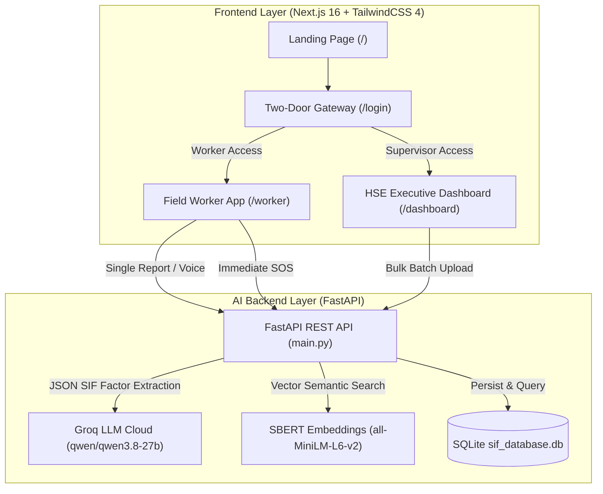

# SIFense — AI-Powered SIF Precursor Detection & Screening Platform

> **Smart India Hackathon (SIH)** // **OIL India Limited**  
> *Transforming industrial safety from reactive accident tracking to proactive predictive precursor screening.*

---

## ⚡ 30-Second Elevator Pitch for Teammates & Judges

> *"In oil fields, thousands of near-miss logs are written every month. Most are trivial (e.g. a broken chair or minor slip), while a few are **fatal precursors** (e.g. a worker entering a gas manifold without atmospheric testing).  
> **SIFense is the AI triage layer that screens all logs in real time, extracts the energy and barrier math, flags the top 5% fatal-potential risks, and pinpoints recurring barrier breakdowns across oil rigs."*

---

## 🗺️ The 3 Core User Journeys

```
 👷 1. FIELD WORKER (Mobile / Rig)          🤖 2. THE AI BRAIN (FastAPI + Groq)        🛡️ 3. HSE SUPERVISOR (HQ Dashboard)
 ┌──────────────────────────────────┐      ┌──────────────────────────────────┐      ┌──────────────────────────────────┐
 │ • 1-Tap Anonymous or Badge Login │      │ • Groq LLM (qwen/qwen3.8-27b)    │      │ • Critical SIF Triage Panel      │
 │ • Voice-to-Text in Hindi/English │ ───► │ • Energy-Barrier SIF Math (DEKRA)│ ───► │ • 1-Click Bulk Batch Ingestion   │
 │ • Quick Hazard Shortcut Chips    │      │ • Bowtie Causal Chain Extraction │      │ • Historical Semantic Twins      │
 │ • Offline Queue & 1-Tap Sync     │      │ • SBERT Vector Similarity Search │      │ • Precursor Trend Line & Alerts  │
 │ • Instant Emergency SOS Button   │      │ • IOGP Life-Saving Rules Mapping │      │ • Human-in-the-Loop AI Audit     │
 └──────────────────────────────────┘      └──────────────────────────────────┘      └──────────────────────────────────┘
```

---

## 🎯 The 4 Core Questions SIFense Solves for OIL India

| # | Operational Safety Question | How SIFense Answers It | Where to See It |
|---|---|---|---|
| **1** | **"Which sites have the highest concentration of SIF precursors?"** | Live geographic aggregation ranks rigs & installations by high-SIF density. | Top Metric Card + Site Ranking Bar Chart |
| **2** | **"What barrier failures are recurring across sites?"** | Decomposes reports to identify repeated systemic defense failures (e.g. *No Atmospheric Testing*, *Missing LOTO*). | Priority Triage Section |
| **3** | **"Which Life-Saving Rules are violated most frequently?"** | Maps incidents to international IOGP standards (*Working at Height*, *Confined Space*, etc.). | Top Violated IOGP Badge Matrix |
| **4** | **"Which specific incidents need immediate mitigation?"** | Filters all reports with $\text{SIF} \ge 60\%$ into an active actionable triage grid. | Actionable Precursor Cards Grid |

---

## 🎪 Step-by-Step Live Demo Script (For Presentations)

Follow this 5-step flow when presenting to judges or stakeholders:

### Step 1: Open the Two-Door Gateway (`/login`)
* Show how **Field Workers** can enter instantly using just their **Badge ID** or **1-Tap Anonymous Whistleblower Mode** (*zero password barriers to encourage reporting*).
* Show how **HSE Supervisors** use corporate credentials or the **1-Click Demo Officer** bypass.

### Step 2: Open the Executive Dashboard (`/dashboard`)
* Point out the **Critical SIF Precursor Triage Panel** at the top separating top fatal-potential risks ($\ge 60\%$) from administrative noise.
* Point out the 4 core metric boxes answering the fundamental safety questions.

### 📂 3. High-Speed Bulk Report Ingestion & Batch Screening Studio
* Accessible directly from the dashboard header (**"Bulk Ingest Logs"**).
* **📁 Multi-Format File Dropzone (CSV / JSON / TXT):** Drag and drop spreadsheets or incident dump files. Automatically detects columns (`location`, `incident_description`, `text`).
* **📥 1-Click "Download Sample CSV Template":** Generates and downloads a pre-formatted template ready for testing.
* **⚡ Parallel Multi-Threaded AI Screening:** Uses a backend `ThreadPoolExecutor` (8 concurrent workers) to screen **10-20 reports simultaneously in ~2 seconds** (a 6x speedup over sequential processing).
* **⚡ 1-Click OIL India Historical Batch:** Instant demo button to screen 10 past incident scenarios.
* **📊 Live Progress Bar & Results Breakdown:** Real-time progress bar with instant count of high-SIF precursors flagged.
* **🔄 Auto-Refreshes SBERT Twins:** Newly ingested logs are immediately vectorized and searchable as historical twins.

### Step 4: Deep-Dive Bowtie & Semantic Historical Twins
* Click on any critical report in the manifest table.
* Show the **Bowtie Causal Chain** (*Initiating Hazard $\rightarrow$ Barrier Failure $\rightarrow$ Potential Consequence*).
* Show the **SBERT Historical Twins** showing past incidents with identical barrier failures across different rigs.

### Step 5: Test the Field Worker App (`/worker`)
* Show hands-free **Voice-to-Text recording** in Hindi/English.
* Tap **Quick Hazard Chips** (*"Working at height without harness"*).
* Demonstrate the **Emergency SOS Button** (which bypasses all AI for sub-millisecond dispatch).

---

## 🏗️ System Architecture & Data Flow



---

## 🧮 How the AI Calculates Risk: The SIF Formula

SIFense utilizes the international **DEKRA Energy-Barrier Framework**:

$$\text{SIF Score} = \frac{\text{Harmful Energy Level (1--3)} \times \text{Barrier Degradation Level (1--3)}}{9.0}$$

| SIF Score Range | Severity Color | Meaning & Action Required |
| :--- | :---: | :--- |
| **$0.60 - 1.00$** | 🔴 **High SIF Potential** | **Fatal Energy + Missing Barrier.** Requires immediate operational stoppage and safety review. |
| **$0.30 - 0.59$** | 🟡 **Medium Risk** | Degraded controls or near-miss with moderate energy. Corrective maintenance needed. |
| **$< 0.30$** | ⚪ **Low Risk** | Minor administrative / first-aid / ergonomic observation. |

---

## 🚀 How to Run Locally in 3 Minutes

### Prerequisites
* Python 3.10+
* Node.js 18+ & `npm`
* Active Groq API Key (Configured in `.env`)

---

### Terminal 1: FastAPI AI Backend

```powershell
# 1. Navigate to project root
cd c:\Users\bhave\sih_final1\SIFense

# 2. Install Python dependencies
pip install -r requirements.txt

# 3. Seed the SQLite database with 30 realistic oil field reports
python seed_data.py

# 4. Start the FastAPI backend
python -m uvicorn main:app --reload --port 8000
```
* **Backend Status:** [http://127.0.0.1:8000](http://127.0.0.1:8000)
* **Interactive Swagger Docs:** [http://127.0.0.1:8000/docs](http://127.0.0.1:8000/docs)

---

### Terminal 2: Next.js Frontend Dashboard

```powershell
# 1. Navigate to frontend directory
cd c:\Users\bhave\sih_final1\SIFense\hse-dashboard

# 2. Install Node packages
npm install

# 3. Start Next.js development server
npm run dev
```
* **Frontend Application:** **[http://localhost:3000](http://localhost:3000)**

---

## 📂 Quick Codebase Navigation

```
sih_final1/
└── SIFense/
    ├── main.py                     # FastAPI server, Groq LLM prompt & SBERT twin matching
    ├── seed_data.py                # 30-incident dataset generator
    ├── requirements.txt            # Python dependencies (FastAPI, Groq, PyTorch, SBERT)
    ├── .env                        # Environment secrets (GROQ_API_KEY)
    │
    └── hse-dashboard/              # Next.js 16 App Router Frontend
        ├── app/
        │   ├── page.tsx            # Landing Page with system protocols
        │   ├── login/page.tsx      # Two-Door Split Login Gateway (Worker vs Officer)
        │   ├── dashboard/page.tsx  # HSE Dashboard: Critical Triage & Bulk Upload
        │   ├── worker/page.tsx     # Field Worker App: Voice Studio & SOS Switch
        │   ├── layout.tsx          # Root Layout with AuthProvider
        │   └── globals.css         # Industrial Brutalist design system & animations
        │
        └── lib/
            ├── auth-context.tsx    # Role-based auth hook (Worker vs Officer vs Demo)
            └── supabase/           # Browser & server Supabase client configuration
```

---

## 📡 REST API Quick Reference

| Method | Endpoint | Role | Description |
| :--- | :--- | :---: | :--- |
| `GET` | `/api/v1/reports/dashboard` | 🛡️ Officer | Fetches all reports, critical SIF precursors, recurring barriers, and trend metrics |
| `POST` | `/api/v1/reports/bulk-upload` | 🛡️ Officer | Ingests and batch-screens multiple historical safety logs |
| `POST` | `/api/v1/reports/submit` | 👷 Worker | Dual-head near-miss report submission |
| `POST` | `/api/v1/emergency/sos` | 👷 Worker | Sub-millisecond emergency SOS alert (bypasses AI) |
| `GET` | `/api/v1/reports/{id}/twins` | 🛡️ Officer | Finds top 3 semantic historical twins using SBERT cosine similarity |
| `GET` | `/api/v1/reports/{id}/explanation` | 🛡️ Officer | Returns SHAP explainability and Bowtie causal chain breakdown |
| `POST` | `/api/v1/reports/{id}/feedback` | 🛡️ Officer | Human-in-the-loop audit (Confirm / Reject) |

---

## 🏆 Project Highlights for Judges
1. **Solves the Real Problem:** Screener/triage layer on top of existing logs, not just another report form.
2. **True Multilingual NLP:** Handles mixed Hinglish, Hindi, and English oil field terminology.
3. **Sub-Millisecond Dual-Head Safety:** Critical emergencies bypass AI latency; near-misses get deep triage.
4. **Offline Resilience:** Field workers in remote drilling locations can queue reports offline with automatic sync.
5. **Human-in-the-Loop Accountability:** Supervisors can audit and confirm/reject AI classifications to build continuous training datasets.

---

### 🛡️ Repository
* **GitHub Repository:** [https://github.com/bhavesh2148/sih-final](https://github.com/bhavesh2148/sih-final)
